# GVM-Bridge

Integration through VM inter-modulation protocols

### Construction project template

Use template in frontier as the project template.  

```sh
git clone -b pallet-evm-v5.0.0 https://github.com/paritytech/frontier.git
cd frontier
cargo build --release  //Verify that the template compiles correctly
```

#### Add Contract Pallets in Runtime

./template/runtime/Cargo.toml

```sh
[dependencies]
pallet-contracts = { version = "3.0.0-dev", default-features = false, git = "https://github.com/paritytech/substrate.git", branch = "frontier" }
pallet-contracts-primitives = { version = "3.0.0-dev", default-features = false, git = "https://github.com/paritytech/substrate.git", branch = "frontier" }
pallet-contracts-rpc-runtime-api = { version = "3.0.0-dev", default-features = false, git = "https://github.com/paritytech/substrate.git", branch = "frontier" }

[features]
default = ["std", "aura"]
aura = []
manual-seal = []
std = [
# write only what needs to be added
	"pallet-contracts/std",
	"pallet-contracts-primitives/std",
	"pallet-contracts-rpc-runtime-api/std",
]
```
After the current template introduces the dependencies required by the project, the path dependency of the template itself is changed to the corresponding Github address and the specified branch.  Avoid version conflicts caused by partial reliance on github addresses during subsequent builds.  for specific modifications, please refer to：[node](https://github.com/luo4lu/frontier_for_gvm/blob/main/template/node/Cargo.toml) and [runtime](https://github.com/luo4lu/frontier_for_gvm/blob/main/template/runtime/Cargo.toml).

runtime/Cargo.toml

execute in current directory:

```sh
cargo build --release
```

Make sure the project template runs correctly, and also load the dependency library to facilitate automatic completion when writing code later.  

### Use GVM-Bridge

You can prepare the engineering template by referring to the above content before using it. The current case runs on the basis of  [this template](###Construction project template).

#### Import the Pallet Crate

To add GVM Bridge modules, first pallet-vm-bridge crate needs to be imported into the Cargo. toml file of Runtime.  

Open file`./template/runtime/Cargo.toml`，You will see all pallets dependent on runtime, now add pallet-vm-bridge components: 

###### runtime/Cargo.toml

```sh
[dependencies]
#--snip--
pallet-vm-bridge = {default-features = false, git = 'https://github.com/luo4lu/GVM_bridge.git', version = '0.1.0'}
#The generator used to supply randomness to contracts through `seal_random`.
pallet-evm-precompile-call-vm = {default-features = false, git = 'https://github.com/luo4lu/GVM_bridge.git', version = '0.1.0'}
```

####  Crate features

One thing to take care of when importing Crates is to make sure that the 'features' in crate are set properly. When runtime is built using its std features, GVM Bridge Pallet should also be built using its std features. Add the following code to the std feature at run time.

###### runtime/Cargo.toml

```sh
[features]
default = ["std"]
std = [
    #--snip--
    'pallet-vm-bridge/std',
    "pallet-evm-precompile-call-vm/std",
    #--snip--
]
```

Before proceeding, run the following command to check that the new dependency is resolved correctly:  

```sh 
cargo +nightly-2021-08-01 check -p frontier-template-runtime
```

- If the following error occurs during the adding process:

```sh
error: the wasm32-unknown-unknown target is not supported by default, you may need to enable the "js" feature. For more information see: https://docs.rs/getrandom/#webassembly-support
     --> /home/luo4lu/.cargo/registry/src/github.com-1ecc6299db9ec823/getrandom-0.2.3/src/lib.rs:219:9
      |
  219 | /         compile_error!("the wasm32-unknown-unknown target is not supported by \
  220 | |                         default, you may need to enable the \"js\" feature. \
  221 | |                         For more information see: \
  222 | |                         https://docs.rs/getrandom/#webassembly-support");
      | |_________________________________________________________________________^

  error[E0433]: failed to resolve: use of undeclared crate or module `imp`
     --> /home/luo4lu/.cargo/registry/src/github.com-1ecc6299db9ec823/getrandom-0.2.3/src/lib.rs:246:5
      |
  246 |     imp::getrandom_inner(dest)
      |     ^^^ use of undeclared crate or module `imp`
```

The template function build.rs needs to build a WASM file. While random number generation is used in our project, the reference document needs to specify feature, add corresponding crate and specify feature  .

runtime/Cargo.toml

```sh
getrandom = { version = "0.2", features = ["js"] }
```

#### Pallet is realized in Runtime for the above two pallets

```sh
//--snip--
use sp_runtime::traits::{Convert}
use sp_runtime::PerThing;
use pallet_contracts::{
	BalanceOf,
	chain_extension::{
		Environment, Ext, SysConfig, RetVal,
		UncheckedFrom, InitState, 
	},
};
use pallet_evm::FeeCalculator;
//--snip--
parameter_types! {
	pub const SignedClaimHandicap: u32 = 2;
	pub const TombstoneDeposit: u64 = 16;
	pub const DepositPerContract: u64 = 8 * DepositPerStorageByte::get();
	pub const DepositPerStorageByte: u64 = 10_000_000;
	pub const DepositPerStorageItem: u64 = 10_000_000;
	pub RentFraction: Perbill = PerThing::from_rational(4u32, 10_000u32);
	pub const SurchargeReward: u64 = 50_000_000;
	pub const MaxDepth: u32 = 100;
	pub const MaxValueSize: u32 = 16_384;
	pub const DeletionQueueDepth: u32 = 1024;
	pub const DeletionWeightLimit: Weight = 500_000_000_000;
	pub const MaxCodeSize: u32 = 100 * 1024;
}

impl Convert<Weight, BalanceOf<Self>> for Runtime {
	fn convert(w: Weight) -> BalanceOf<Self> {
		w.into()
	}
}

impl pallet_contracts::Config for Runtime {
	type Time = Timestamp;
	type Randomness = RandomnessCollectiveFlip;
	type Currency = Balances;
	type Event = Event;
	type RentPayment = ();
	type SignedClaimHandicap = SignedClaimHandicap;
	type TombstoneDeposit = TombstoneDeposit;
	type DepositPerContract = DepositPerContract;
	type DepositPerStorageByte = DepositPerStorageByte;
	type DepositPerStorageItem = DepositPerStorageItem;
	type RentFraction = RentFraction;
	type SurchargeReward = SurchargeReward;
	type MaxDepth = MaxDepth;
	type MaxValueSize = MaxValueSize;
	type WeightPrice = Self;
	type WeightInfo = ();
	type ChainExtension = Self;
	type DeletionQueueDepth = DeletionQueueDepth;
	type DeletionWeightLimit = DeletionWeightLimit;
	type MaxCodeSize = MaxCodeSize;
}

parameter_types! {
	pub const Enable2EVM: bool = true;
	pub const Enable2WasmC: bool = true;
}
impl pallet_vm_bridge::Config for Runtime {
	type Currency = Balances;
	type Call = Call;
	type Event = Event;
	type Enable2EVM = Enable2EVM;
	type Enable2WasmC = Enable2WasmC;
}
```

1. To implement the Bridge invocation of GVM-Bridge, you need to implement the external invocation attribute when configuring to implement pallets_contracts and pallet_evm. Add the following code to the Runtime:  

```sh
impl pallet_evm_precompile_call_vm::EvmChainExtension<Runtime> for Runtime {
	fn call_vm4evm(
		origin: Origin,
		data: Vec<u8>,
		target_gas: Option<u64>,
	) -> Result<(Vec<u8>, u64), sp_runtime::DispatchError> {
		GvmBridge::call_wasm4evm(origin, data, target_gas)
	}
}
/***snip***/
impl pallet_contracts::chain_extension::ChainExtension<Runtime> for Runtime {
	fn call<E>(fun_id: u32, env: Environment<E, InitState>) -> Result<RetVal, sp_runtime::DispatchError>
	where
		E: Ext<T = Runtime>,
		<E::T as SysConfig>::AccountId: UncheckedFrom<<E::T as SysConfig>::Hash> + AsRef<[u8]>,
	{
		match fun_id {
			5 => GvmBridge::call_evm4wasm::<E>(env),
			_ => Err(sp_runtime::DispatchError::from(
				"Passed unknown func_id to chain extension",
			)),
		}
	}
}
```

2.Modify pallet_evm::Config for Runtime in the original template ：

```sh
impl pallet_evm::Config for Runtime：{
/***snip***/
type Precompiles = (
		pallet_evm_precompile_simple::ECRecover,
		pallet_evm_precompile_simple::Sha256,
		pallet_evm_precompile_simple::Ripemd160,
		pallet_evm_precompile_simple::Identity,
		pallet_evm_precompile_call_vm::CallVm<Self>,
		pallet_evm_precompile_modexp::Modexp,
		pallet_evm_precompile_simple::ECRecoverPublicKey,
		pallet_evm_precompile_sha3fips::Sha3FIPS256,
		pallet_evm_precompile_sha3fips::Sha3FIPS512,
	);
/***snip***/
}
```

3.Implementation of pallet_contracts callable RPC interface

```sh
impl pallet_contracts_rpc_runtime_api::ContractsApi<Block, AccountId, Balance, BlockNumber> for Runtime {
		fn call(
            origin: AccountId,
            dest: AccountId,
            value: Balance,
            gas_limit: u64,
            input_data: Vec<u8>,
        ) -> pallet_contracts_primitives::ContractExecResult {
            Contracts::bare_call(origin, dest, value, gas_limit, input_data)
        }
        fn get_storage(
            address: AccountId,
            key: [u8; 32]
        ) -> pallet_contracts_primitives::GetStorageResult {
            Contracts::get_storage(address, key)
        }
        fn rent_projection( address: AccountId) -> pallet_contracts_primitives::RentProjectionResult<BlockNumber> {
            Contracts::rent_projection(address)
        }
	}

```

#### Add GVM Bridge and Pallet contracts to construct_runtime! Inside the Macro

GVM Bridge Pallet needs to be added to Construct_Runtime! The macro needs to decide on the pallet public type so that we can tell the Runtime which modules are there.  

By looking at the file GVM-Bridge/frame/vm-bridge/src/lib.rs, We can know the use of:

\#[pallet::event]、\#[pallet::call]、\#[pallet::storage]、\#[pallet::pallet]

We need to add pallets :

###### runtime/src/lib.rs

```sh
construct_runtime!(
    pub enum Runtime where
        Block = Block,
        NodeBlock = opaque::Block,
        UncheckedExtrinsic = UncheckedExtrinsic
    {
        /* --snip-- */
        /*** Add These Line ***/
       Contracts: pallet_contracts::{Module, Call, Config<T>, Storage, Event<T>},
	   GvmBridge: pallet_vm_bridge::{Module, Call, Storage, Event<T>},
    }
);
```

### Add depends on Pallet creation configuration

Not all pallets need genesis configuration, contract bridging involves contract Pallets need genesis configuration. You can check the source code of corresponding Pallets or documentation.  

The build configuration is configured in node/ src /chain_spec.rs.  Import dependencies in the corresponding directory:  

node/Cargo.toml

```sh
pallet-contracts-rpc = { git = "https://github.com/paritytech/substrate.git", branch = "frontier" }
pallet-contracts = { git = "https://github.com/paritytech/substrate.git", branch = "frontier" }
```

1.The header of the chain_spec. rs file contains the ContractsConfig type data, and at the end of the file, add specific Pallets in the testnet_genesis function.  

node/src/chain_spec.rs

```sh
use frontier_template_runtime::{
	ContractsConfig,
};

#--snip--
/// Configure initial storage state for FRAME modules.
fn testnet_genesis(
	wasm_binary: &[u8],
	initial_authorities: Vec<(AuraId, GrandpaId)>,
	root_key: AccountId,
	endowed_accounts: Vec<AccountId>,
	_enable_println: bool,
) -> GenesisConfig {
	GenesisConfig {
	/* --snip--*/
    pallet_contracts: ContractsConfig{
    	current_schedule: pallet_contracts::Schedule::default(),
    },
	/*** End Added Block***/
	}
}
```

2.Instantiate the newly added RPC extension for Contracts.

node/src/rpc.rs

```sh
use frontier_template_runtime::{opaque::Block, AccountId, Balance, Hash, Index, BlockNumber};
/* --snip--*/
/* --this add-- */
use pallet_contracts_rpc::{Contracts, ContractsApi};

/* --snip--*/
pub fn create_full<C, P, BE>(
	deps: FullDeps<C, P>,
	subscription_task_executor: SubscriptionTaskExecutor,
) -> jsonrpc_core::IoHandler<sc_rpc::Metadata>{
	/* --snip--*/
	io.extend_with(EthPubSubApiServer::to_delegate(EthPubSubApi::new(
		pool.clone(),
		client.clone(),
		network.clone(),
		SubscriptionManager::<HexEncodedIdProvider>::with_id_provider(
			HexEncodedIdProvider::default(),
			Arc::new(subscription_task_executor),
		),
		overrides,
	)));
	/* --this add-- */
	io.extend_with(ContractsApi::to_delegate(Contracts::new(client.clone())));
	/*** End Added Block***/
}

```

The preceding steps only include gVM-Brigde runtime dependencies and its own configuration parameters.  

In order to facilitate the later deployment of the contract, change the initial account amount recharge in EVMConfig to its own Matemask wallet address:  

node/src/chain_spec.rs

```sh
pallet_evm: EVMConfig {
			accounts: {
				let mut map = BTreeMap::new();
				map.insert(
					// H160 address of Alice dev account
					// Derived from SS58 (42 prefix) address
					// SS58: 5GrwvaEF5zXb26Fz9rcQpDWS57CtERHpNehXCPcNoHGKutQY
					// hex: 0xd43593c715fdd31c61141abd04a99fd6822c8558 854ccde39a5684e7a56da27d
					// Using the full hex key, truncating to the first 20 bytes (the first 40 hex chars)Here is my wallet address, according to their actual address modification
					H160::from_str("2d495b4205bF0d5B1064ea1aA622b612D926fF96")
						.expect("internal H160 is valid; qed"),
					pallet_evm::GenesisAccount {
						balance: U256::from_str("0xffffffffffffffffffffffffffffffff")
							.expect("internal U256 is valid; qed"),
						code: Default::default(),
						nonce: Default::default(),
						storage: Default::default(),
					},
				);
				map.insert(
					// H160 address of CI test runner account
					H160::from_str("6be02d1d3665660d22ff9624b7be0551ee1ac91b")
						.expect("internal H160 is valid; qed"),
					pallet_evm::GenesisAccount {
						balance: U256::from_str("0xffffffffffffffffffffffffffffffff")
							.expect("internal U256 is valid; qed"),
						code: Default::default(),
						nonce: Default::default(),
						storage: Default::default(),
					},
				);
				map
			},
		},
```

The code to implement the contract GVM-Bridge functionality in runtime is now complete and the node program can be compiled and run. But intermodulation between contracts requires that the invocation interface be implemented at contract writing time.  
```sh
cargo +nightly-2021-08-01 build --release
```

### Contract interface implementation

To realize the bridging function, first of all, on the realization of the contract, you need to specify the type of traits and invoke interface methods for data, and then make new Pallets invoke across the contract through GVM-Bridge Pallets.  

#### WASM contract implementation

By defining the trait method in the contract implementation, the method specifying the trait association type is supported in the contract implementation to achieve contract intermodulation. 

Custom trait:

```sh
#[ink::chain_extension]
pub trait MyChainExtension {
        type ErrorCode = i32;

        #[ink(extension = 5, handle_status = false, returns_result = false)]
        fn call_evm_extension(vm_input: &str) -> String;
}
```

In the ink! Implement a custom trait type in the Environment type definition of:  

```sh
#[derive(Debug, Clone, PartialEq, Eq)]
#[cfg_attr(feature = "std", derive(scale_info::TypeInfo))]
pub enum CustomEnvironment {}

impl Environment for CustomEnvironment {
    /*** snip ***/
    type ChainExtension = MyChainExtension;
}

```

The contract implementation specifies the supported environment type via the inkling :: contract macro:  

```sh
#[ink::contract(env = crate::CustomEnvironment)]
mod erc20{
	/***snip***/
	
	//Specify the calling method in the contract function function module (here is an example of how the WASM contract calls the EVM contract)  
	#[ink(message)]
    pub fn wasmCallEvm(
    &mut self,
    acnt: String,
    to: String,
    value: Balance,
    ) -> Result<String> {
    //let caller = self.env().caller();

        let mut input = r#"{"VM":"evm", "Account":""#.to_string();
        input.push_str(&acnt);
        input.push_str(r#"", "Fun":"transfer(address,uint256)", "InputType":["address","uint"], "InputValue":[""#);
        input.push_str(&to);
        input.push_str(r#"", ""#);
        input.push_str(&value.to_string());
        input.push_str(r#""],  "OutputType":[["bool"]]}"#);

        //input = '{"VM":"evm", "Account":"0x' + acnt.to_string() + '", "Fun":"transfer(address,uint256)", "InputType":["address","uint"], 
        //"InputValue":["0x' + to.to_string() +'", "' + value.to_string() + '"],  "OutputType":[["bool"]]}';

        let ret = self.env().extension().call_evm_extension(&input);
        Ok(ret)
    }

}
```

This is done by parsing the input message in the wasmCallEvm function and eventually by calling the call_evm_extension method in the custom trait.  

Wasm contracts are implemented in this way to support invoking specified contract functions.  

The current project provides testable WASM contracts for testing：[erc20wasm](https://github.com/luo4lu/GVM_bridge/blob/main/external/contract/src/erc20wasm/lib.rs).

#### EVM contract implementation

Just like WASM contract implementation principle, in the contract to implement the specified calling function _callWasmC, passing in the appropriate binary string to be called, through the implementation of the contract in different calling methods to call WASM contract.  

```sh
function _callWasmC(string memory input) internal returns (string memory) {
		uint inputLen = bytes(input).length + 32;  //First 32bytes is string len prefix
		bytes memory outbytes = new bytes(1024);
		uint gasdata = gasleft();
		assembly {
			if iszero(delegatecall(gasdata, 0x05, input, inputLen, outbytes, 1024)) {
				revert(0,0)
			}
		}
		return string(outbytes);
	}
	
function evmCallWasm(bytes32 bob, uint256 value, bytes32 contractid) public returns (string memory) {
		
		bytes memory input1 = bytes('{"VM":"wasm", "Account":"0x');
		input1 = _bytesConcat(input1, bytes(_bytes32tohex(contractid)));
		input1 = _bytesConcat(input1, bytes('", "Fun": "transfer", "InputType": ["accountid","u128"], "InputValue": ["0x'));
		input1 = _bytesConcat(input1, bytes(_bytes32tohex(bob)));
		input1 = _bytesConcat(input1, bytes('","'));
		input1 = _bytesConcat(input1, bytes(_uint2str10(value)));
		input1 = _bytesConcat(input1, bytes('"], "OutputType":[["enum"],["0","2"],["0"]]}'));
		
		//string input = '{"VM":"wasm", "Account":"0x' + _bytes32tohex(contractid) + '", "Fun": "transfer", "InputType": ["accountid","u128"], 
		//"InputValue": ["0x' + _bytes32tohex(bob) + '","'+ _uint2str10(value) + '",], "OutputType":[["enum"],["0","2"],["0"]]}';
		
		return _callWasmC(string(input1));
	}
```

evmCallWasm implements the invocation of the contract by encapsulating the characteristics of the specified input character with a call to _callWasmC resolution.  
The current project provides testable EVM contracts for testing：[erc20evm](https://github.com/luo4lu/GVM_bridge/blob/main/external/contract/src/erc20evm/TestEvmToken.sol).

#### Start chain node

First compile the release node execution file from the node-temp root:  

```sh
cargo +nightly-2021-08-01 build --release
```

##### Start the node（Parameter comment --help View）：

```sh
./target/release/frontier-template-node --dev --tmp --rpc-port 8545 --rpc-cors=all
```

Parameters are set for later connection to Matemask deployment of evM contracts.

The following screen is displayed when the node runs normally:

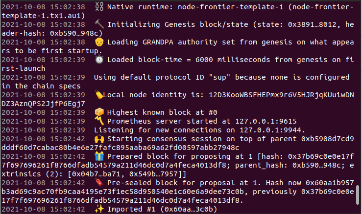

##### Contract deployment

If EVM contracts need to be invoked using WASM, the WASM contract needs to be deployed to the chain node first, and vice versa.  

Here both types of contracts are deployed on the chain in advance for later validation. If you don't know the contract deployment implementation refer to the following documentation for the implementation node's support of different contracts and the use of the RPC interface.

Wasm contract：[The use of contract in Runtime  ](https://substrate.dev/docs/zh-CN/tutorials/add-contracts-pallet/)

EVM contract：[Substarte Frontier Workshop](https://substrate.dev/docs/zh-CN/tutorials/frontier/)

Complete the above two tutorials and restart the node. The following describes only the contract deployment and the successful deployment page:  

Use [Polkadot-JS App UI](https://polkadot.js.org/apps/?rpc=ws%3A%2F%2F127.0.0.1%3A9944#/extrinsics)to test node contract invocation, enter the interface to select the local network node, and click switch to see the node network of the current device.  

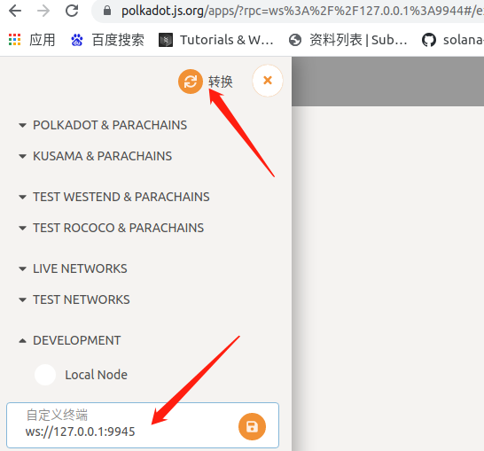

###### Deploy the WASM contract  

Developer->Contract->Upload & deploy code,Select an account with a 0 available account balance to perform the test. Click upload .contract next to confirm deployment, where the "endowment" line requires a certain number of units. Otherwise, the deployment fails, as shown in the figure below:  

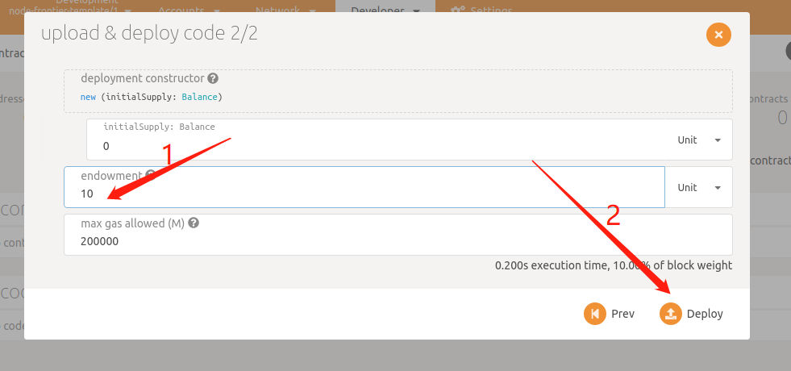

After the deployment is successful, existing contract files can be displayed on the current page:  

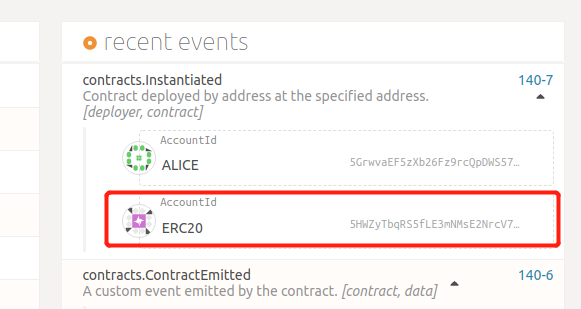

###### Deploy the EVM contract  

Use [Remix](https://remix.ethereum.org/#optimize=true&runs=200&evmVersion=null&version=soljson-v0.6.12+commit.27d51765.js) to deploy the contract, open the connection to create a new file paste has been implemented contract file compilation.  

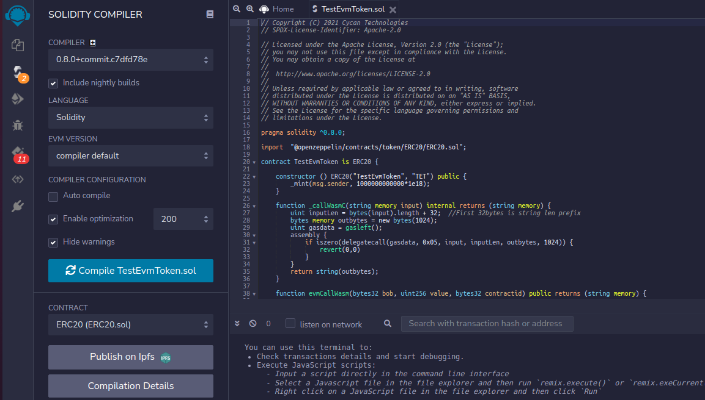

The contract is successfully compiled as shown above, then connect to Matemask to deploy the EVM contract: 

1、Open matemask to connect to local node:  Networks->Custom RPC

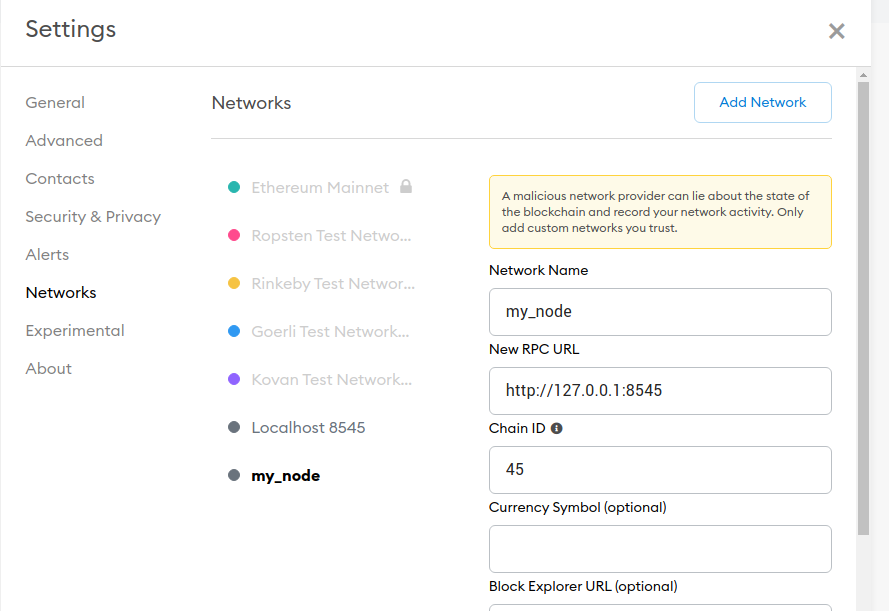

The Network Name is customized；New RPC URL It is currently local and the port is specified at startup；Chain ID is the value set by Runtime when EVM is implemented，The default value 42 is not recommended to prevent conflicts. Save.

2、Remix->DEPLOY & RUN TRANSACTIONS The configuration is as follows:

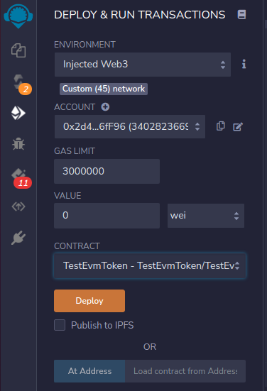

ENVIRONMENT：Specially Web3 will automatically identify the current node chain ID network  

ACCOUNT：Matemaks wallet address  

GAS LIMIT:	Use default values

CONTRACT：The contract file compiled in the previous step

3、Click Deploy and confirm in Matemask to see the contract successfully deployed message:  

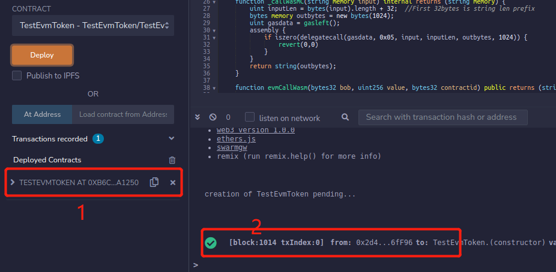

The return message at the marker 2 position shows that the contract has been deployed successfully, Expand 1 to see the address and contract interface of the current contract deployment.  

#### Contract is called

##### evm call wasm

Before using contract intermodulation，The EVM contract in the current test contract allocates contract tokens. Before the test, transfer should be made to each calling account to ensure sufficient account balance. Transfer to Alice's account as follows:  

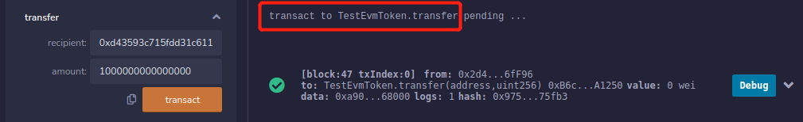

Transaction interface transfer parameters，recipient: A 20-byte transaction address；amount： transaction  amount（It is advisable to transfer more amounts here to avoid errors being reported in subsequent operations due to insufficient amounts）。

Expand the function interface below the contract address returned by the contract deployment in the previous step to briefly show the interface call results and parameter descriptions take evmCallWasmBalance as an example：

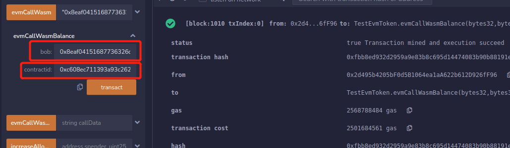

According to the contract implementation interface function, we can know:

```sh
function evmCallWasmBalance(bytes32 bob, bytes32 contractid) public returns (uint) {
		
		bytes memory input1 = bytes('{"VM":"wasm", "Account":"0x');
		input1 = _bytesConcat(input1, bytes(_bytes32tohex(contractid)));
		input1 = _bytesConcat(input1, bytes('", "Fun": "balance_of", "InputType": ["accountid"], "InputValue": ["0x'));
		input1 = _bytesConcat(input1, bytes(_bytes32tohex(bob)));
		input1 = _bytesConcat(input1, bytes('"], "OutputType":[["u128"]]}'));
		
		//string input = '{"VM":"wasm", "Account":"0x' + _bytes32tohex(contractid) + '", "Fun": "balance_of", "InputType": ["accountid"], 
		//"InputValue": ["0x' + _bytes32tohex(bob)], "OutputType":[["u128"]]}';
		
		string memory result = _callWasmC(string(input1));
		return getResultBalance(result);
	}
```

bob：Address of the account to perform the balance of operation（32 byte address）；

contractid: The current EVM contract bridge needs to be connected to the ink! contract address to be invoked  （32byte address）。

Click On Transact ，On the Remix page, the preceding information is displayed.

The contractid contract address can be obtained by:

You can view the ink contract deployed successfully in the [Polkadot-JS App UI](https://polkadot.js.org/apps/?rpc=ws%3A%2F%2F127.0.0.1%3A9944#/extrinsics)

Developer->Contracts：Expand the contract to see the contract call interface inside，exec expands an interface to see the contract address information:

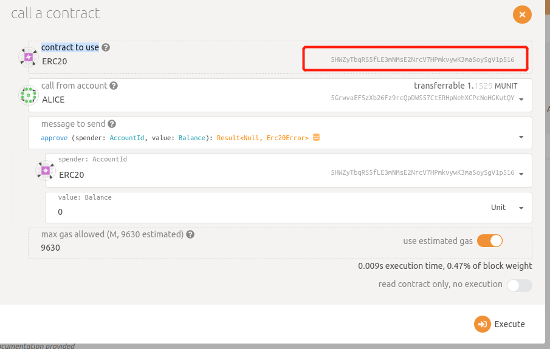

The ERC20 contract to be used is the contract file we just deployed to support bridge intermodulation. Copy the following address and use the subkey tool to convert the SS58 address to hex address.  

example：subkey inspect  5GrwvaEF5zXb26Fz9rcQpDWS57CtERHpNehXCPcNoHGKutQY   

##### wasm call evm

Developer->Contracts，You can view the deployed contract file and hash code. Click Message to see the call method implemented in the contract.  

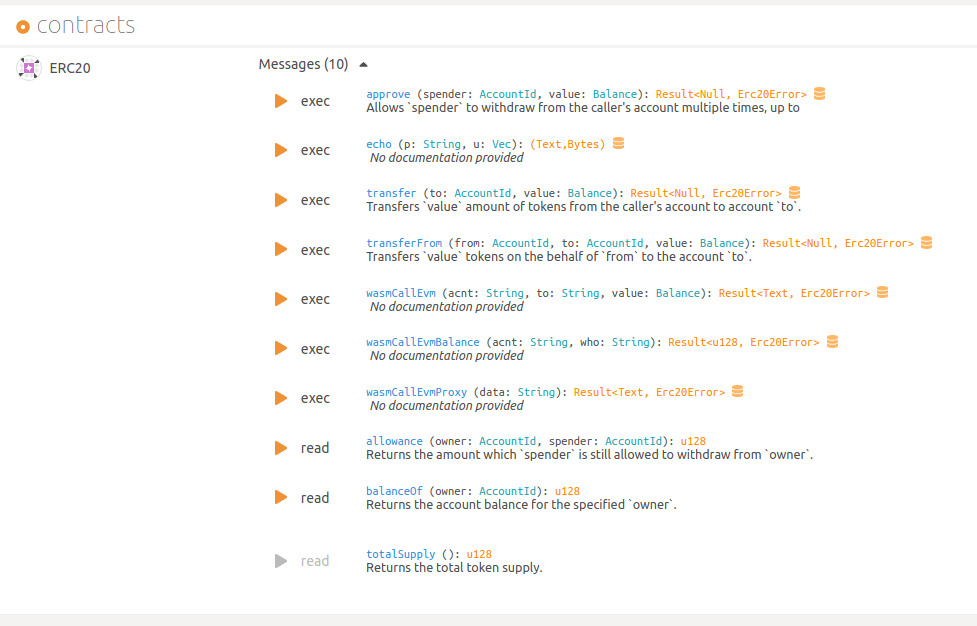

You can see the external calling function implemented in the contract,Also, to simply display the interface call results and parameter description, take wasmCallEvmBalance as an example, expand exec:  

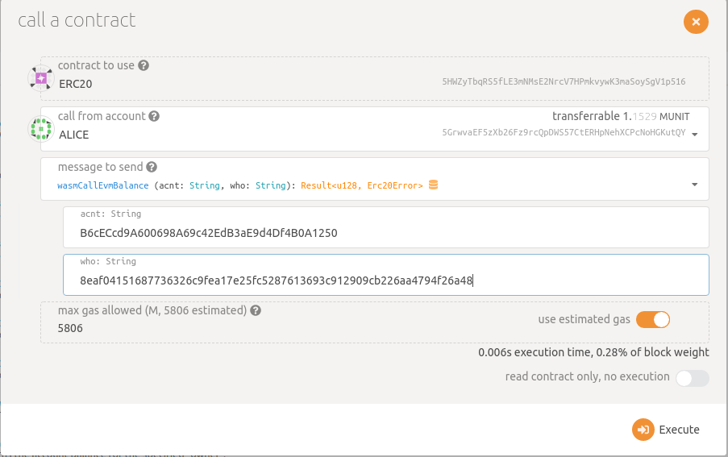

The contract code for the function：

```sh
#[ink(message)]
        pub fn wasmCallEvmBalance(
            &mut self,
            acnt: String,
            who: String,
        ) -> Result<Balance> {
            //let caller = self.env().caller();

			let mut input = r#"{"VM":"evm", "Account":""#.to_string();
			input.push_str(&acnt);
			input.push_str(r#"", "Fun":"balanceOf(address)", "InputType":["address"], "InputValue":[""#);
			input.push_str(&who);
			input.push_str(r#""],  "OutputType":[["uint"]]}"#);
			
			//input = '{"VM":"evm", "Account":"0x' + acnt.to_string() + '", "Fun":"balanceOf(address)", "InputType":["address"], 
			//"InputValue":["0x' + to.to_string()"],  "OutputType":[["uint"]]}';
			
            let ret = self.env().extension().call_evm_extension(&input);
			let return_value_offset: usize;
			match ret.find(r#""ReturnValue":[""#) {
				Some(r) => return_value_offset = r,
				None => return Err(Error::OtherError(String::from("Call EVM error, no ReturnValue!"))),
			}
			let result: Balance;
			match ret[return_value_offset+16..ret.len()-3].parse::<Balance>() {
				Ok(r) => result = r,
				Err(e) => return Err(Error::OtherError(e.to_string())),
			}
            Ok(result)
        }	
```

You can know the meaning of each parameter by using the function:

acnt: The current WASM contract bridge needs to be connected to the EVM contract address to be invoked;

who:Query balanceof account address;  

Note：Since the Polkadot-JS interface used in the test does not recognize 0x as a string, there is no need to pass in the hexadecimal address representation of 0x when calling the transaction interface.  

Click On Exceute。You can view the success message on the UI or through the [Polkadot-JS App UI Network->Explorer->Chain info->recent events：

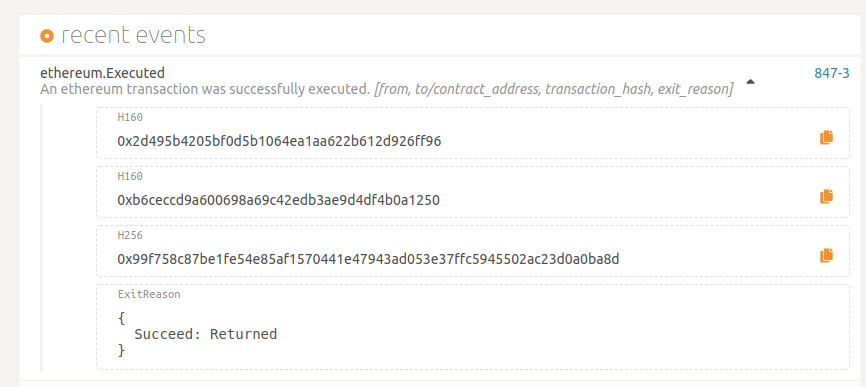

When using a contract to invoke a transaction interface, you need to ensure that the account has an adequate balance,  Use [Polkadot-JS App UI Developer->Contracts，When wasmCallEvm calls EVM contract for transaction, the interface displays value:Balance and the conversion relationship between the value in the contract:  1 Uint = 1000000000000。So, before invoking this interface, it is necessary to recharge the corresponding transfer account through EVM contract to ensure sufficient amount of transfer.  

#### remark

The above is the steps for GVM Bridge Pallets to use. After the chain is started, the [contract files](https://github.com/CycanTech/GVM-Bridge/blob/main/frame/vm-bridge/fixtures) provided in the project can be used for testing and the required files can be generated through the [source code](https://github.com/CycanTech/GVM-Bridge/tree/main/external/contract/src)of the contract.  In the test account, try to ensure that the current account has a balance. There is no fee to submit the transaction, but a donation is required when deploying the WASM contract.  Current Use case [Github]( https://github.com/luo4lu/frontier_for_gvm.git) available code. And the [GVM-Bridge](https://github.com/luo4lu/GVM_bridge.git) code currently in use.  

#### Other

In order to facilitate developers to develop contract inter-call function, we will provide sample codes for WASM contract and EVM contract inter-calling, such as inter-calling ERC20 contract etc.